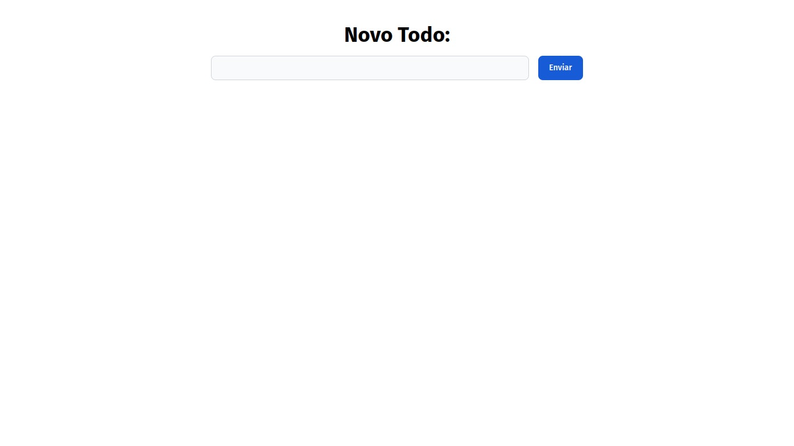

# React Todo App

Um site de Todo App, feito com React, Tailwindcss, Flowbite-react;

## Screenshots



## Rodando localmente

Clone o projeto

```bash
  git clone https://github.com/Lucassimaog6/react-todo-app
```

Entre no diretório do projeto

```bash
  cd react-todo-app
```

Instale as dependências

```bash
  npm i
```

Inicie o servidor

```bash
  npm run dev
```
